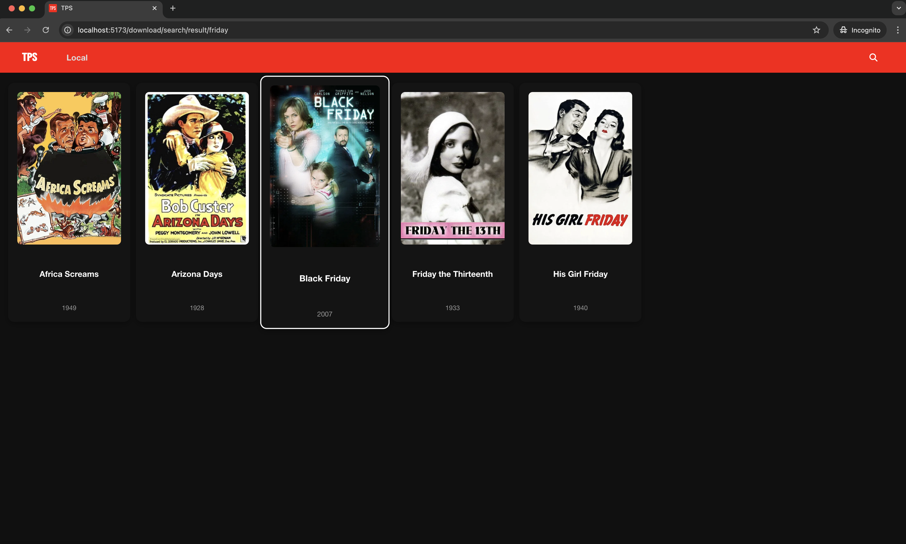
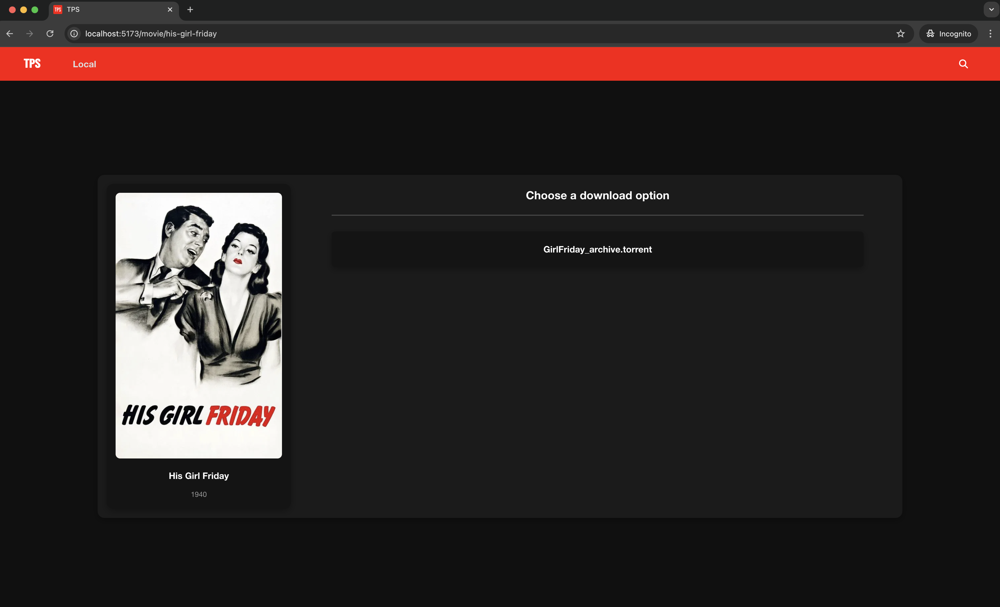
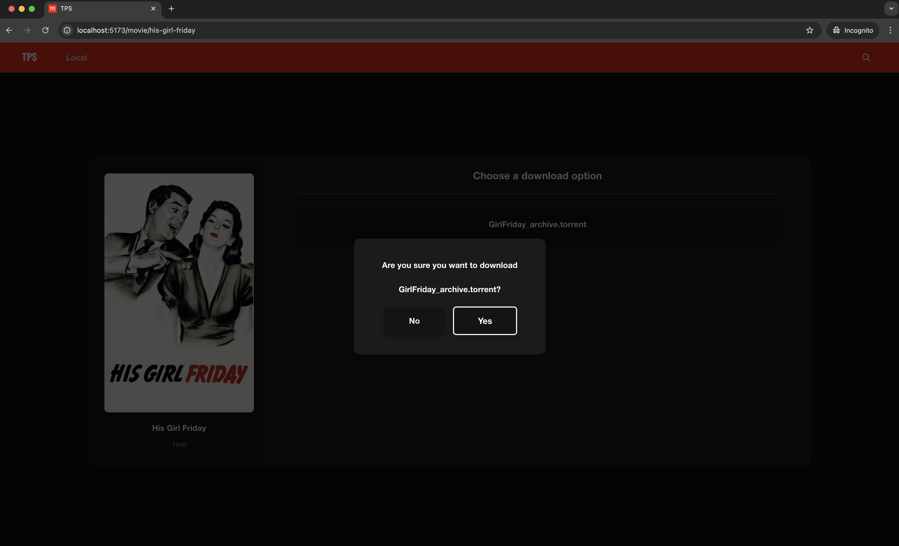

# Torrent Proxy Site





## About

This site currently includes:

- Feature Films — sourced from The Internet Archive
- Public Domain Films — sourced from Public Domain Torrents

## About Torrents & Legality

Torrents use a peer-to-peer (P2P) protocol to share files directly between users, making downloads faster and more decentralized. This site only indexes and provides access to movies that are legally available in the public domain.

Downloading torrents of public domain or freely licensed content is completely legal. However, users should always ensure they respect copyright laws in their jurisdiction and avoid downloading copyrighted material without permission.

## How It Works

- Search for a movie by entering its title in the search bar.
- Choose the movie you want from the search results.
- Select one of the available torrent download options to start downloading the movie directly.
- Once downloaded, the movie will appear in the Local tab for easy playback. English subtitles will be downloaded automatically.

## Installation & Setup

Follow these steps to set up and run the project:

1. **Clone the repository:**

   ```sh
   git clone https://github.com/Aleks-Tacconi/TorrentProxySite.git
   ```

2. **Navigate to the project directory**

    ```sh
    cd TorrentProxySite
    ```

3. **Generate a free tmdb API key from: [https://www.themoviedb.org/](https://www.themoviedb.org/)**

4. **Create a .env file with your api key**

    ```sh
    echo MOVIES="********" > .env
    ```

5. **Build the docker image**

    ```sh
    make build
    ```

6. **Run the docker container**

    ```sh
    make run
    ```

The website will be available on [http://localhost:5173](http://localhost:5173)
